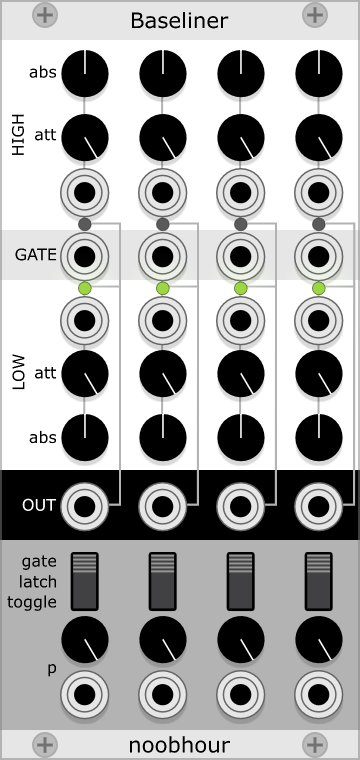

# noobhour modules

## Baseliner

Baseliner returns one of two possible signals ("Signal" or "Base"), based on a gate input. In its basic state, it will 
return Base if the gate is inactive and Signal otherwise. This will let you e.g. mute and unmute modulation signals based on external events like a sequencer input. Signal and Base are obtained via abs + inp * att. 

### Modes and Probabilities
Besides the regular Gate mode, there are two modes, Latch and Toggle, which behave like the modes in Audible Instruments' Bernoulli Gate (Mutable Instruments Branches).

In Gate mode, Signal is returned if Gate is on - but only with probability p, determined each time Gate triggers (switches from off to on).

In Latch mode, Gate is only used as a trigger: When it triggers, the output switches to Signal with probability p or to Base otherwise.

In Toggle mode., Gate is only used as a trigger as well: When it triggers, the output switches from Base to Signal or from Signal to Base with probability p. 

### Patching tips
- Plug in a modulation CV into Signal and a gate input into Gate in order to only pass on Signal if the gate triggers.
- Use the attenuator to shape an incoming modulation signal to your musical needs. If that is all you need, only use the Base input for basic A+B*C functionality. 
- Plug inputs into both Signal and Base and use Latch or Toggle mode to probabilistically switch between the two.

