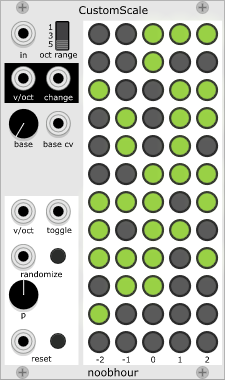

# noobhour modules
A collection of modules for [VCV Rack](https://github.com/VCVRack/Rack).

## Baseliner
A 4x probabilistic attenuverting switch. 

Baseliner returns one of two possible signals (*High* or *Low*), based
on a gate input. In its basic state, it will return *High* if
the gate is active and *Low* otherwise. 

"I see that *Low* defaults to 0, so are you saying you re-invented the
AND gate?" Yea, kind of (awesome, no?). But there are a number of ways
to modify this basic behaviour which I often find useful in turning
raw CV into music. They relate to shaping *High* and *Low*,
and to deciding which signal to return.

### Signal shaping 

The original motivation for this module was to pass on a signal if
gate is on, but have it fall back to a definable baseline, not just 0,
when it's off, hence its name. 

The ways the two signals can be shaped are the same for both; the only
difference is when they are returned. Both *High* and *Low* are computed
as their respective input * *att* + *abs*. If no input is given, this
lets you dial in a constant value via *abs* (-5V..5V). Once you provide
an input, you can offset it using *abs* and attenuate it via *att*, which
is an "attenuverter" i.e. also lets you invert the signal as its value
can be set from -1 to 1. Outputs are clipped to -10V..10V.

### Signal selection

The controls in the darker, lower area of the module can be used to
modify which signal is returned when.

Besides the regular *Gate* mode, there are two modes, *Latch* and *Toggle*,
which behave like the modes in
[Audible Instruments](https://github.com/VCVRack/AudibleInstruments)
Bernoulli Gate (a software implementation of
[Mutable Instruments Branches](https://mutable-instruments.net/modules/branches/)).
There is also a probability input which is computed as the sum of the
knob value (0..1) and the CV input.

- In *Gate* mode, *High* is returned if *Gate* is on - but only with
  probability *p*, determined each time *Gate* triggers (switches from off
  to on).

- In *Latch* mode, *Gate* is only used as a trigger: When it triggers, the
  output switches to *High* with probability *p* or to *Low* otherwise.

- In *Toggle* mode, *Gate* is only used as a trigger as well: When it
  triggers, the output switches from *Low* to *High* or from *High* to
  *Low* with probability *p*.

### Video

Check out the video below, which shows Baseliner in action. It serves
as a rhythm generator, mixer, distorter, melody creator, and drum
sequencer.

## CustomScale
A customizable and writable quantizer.

CustomScale turns a 0V..10V input into V/Oct output, scaling the input
value over the tones selected in the matrix. The center light in the
bottom row corresponds to a V/Oct output of 0, C4 if fed into an
otherwise unmodulated oscillator. Each row further up represents one
half-tone higher, whereas columns to the left and right represent
lower and higher octaves, respectively.

Next to the matrix, there are two areas with controls: The upper one
contains all controls related to playing an existing scale, the
lower one modifies the scale matrix.

### Playing

- *in* receives the CV to be turned into V/Oct. 
- *oct range* controls which of the octaves are used.
- *v/oct* sends the computed V/Oct.
- *change* sends a trigger everytime v/oct changes. 
- *base* adds up to 11 half-tones to the output.
- *base cv* expects a -10V..10V input, adding -11 to 11 half-tones to
  the *base* knobs setting; the final base value will still be 0..11 (C
  to B,if you will).

### Modifying 

- *v/oct* receives a frequency. If the tone has a corresponding light
  on the matrix, it will be toggled when *toggle* receives a
  trigger. This means you can control the matrix from e.g. a keyboard
  or a sequencer (or another CustomScale, gasp). The *base* offset is
  not taken into consideration).
- *randomize* will set the matrix randomly, with the probability of a
  particular light being on controlled by *p*.
- *reset* will turn off all lights on the matrix. 

